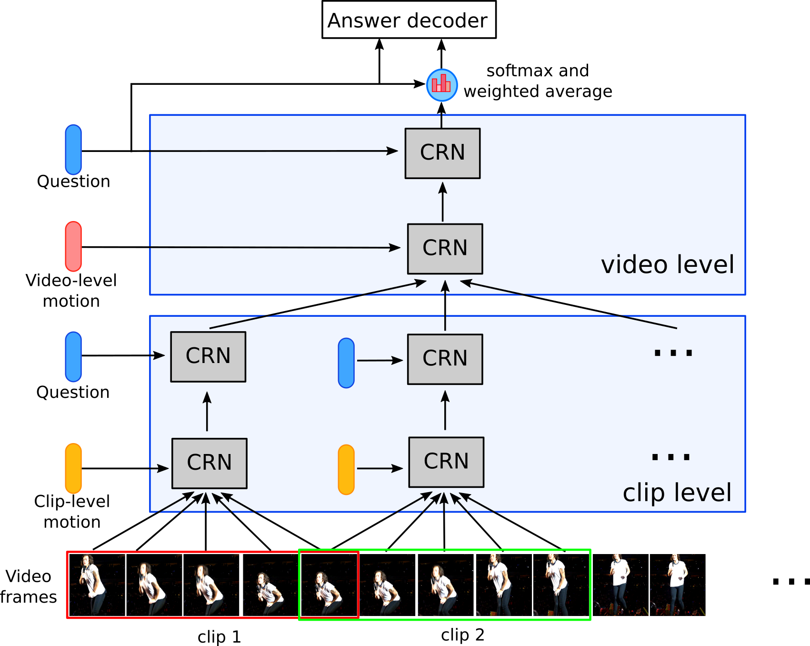
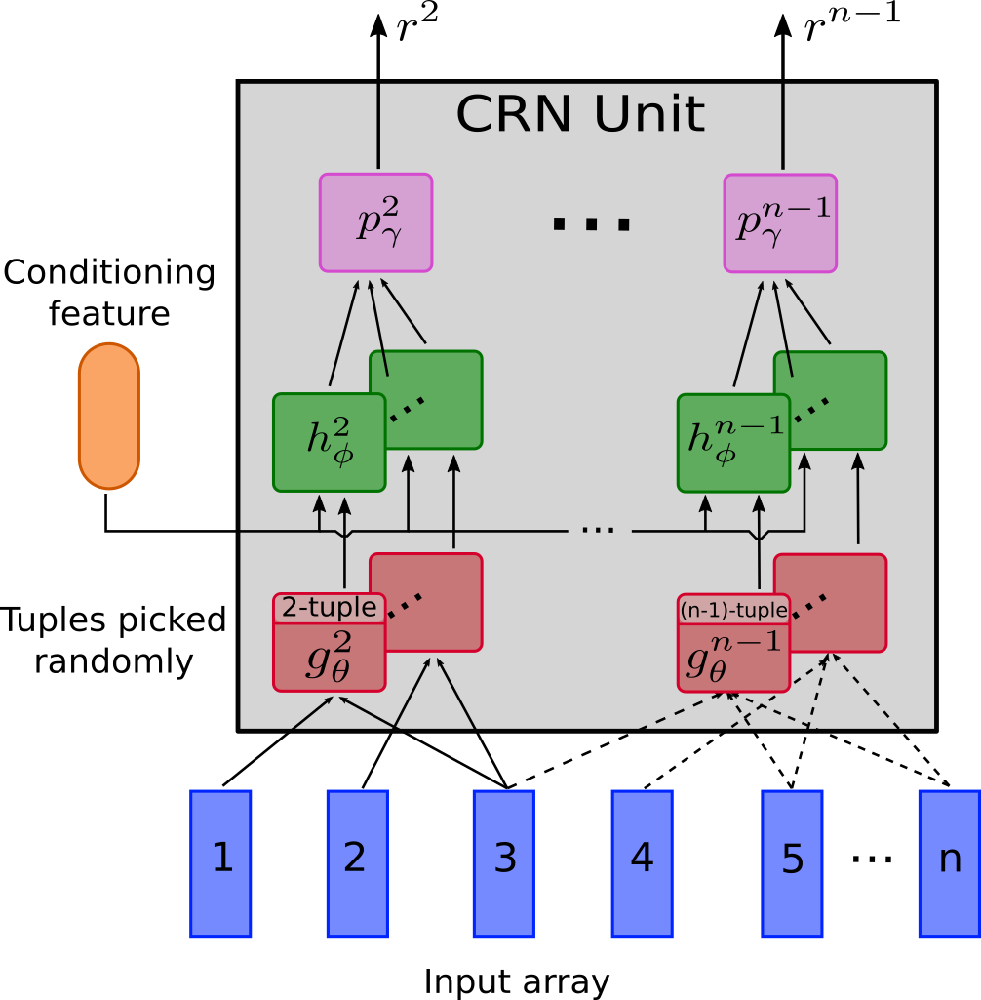

# Video Question Answering with HCRN
Final project on video question answering for the Master MVA Recvis 2020/2021 class.

This project is based on the paper <a href='https://arxiv.org/abs/2002.10698'>"Conditional Relation Networks
for Video Question Answering"</a>. Le et al 2020

We build upon it to replace the Glove Text encoding by a BERT text encoder and adapt the multimodal setup to include subtitles modalities in the TVQA dataset.
The following visuals where taken from Le et al paper. They explain how the HCRN model work

